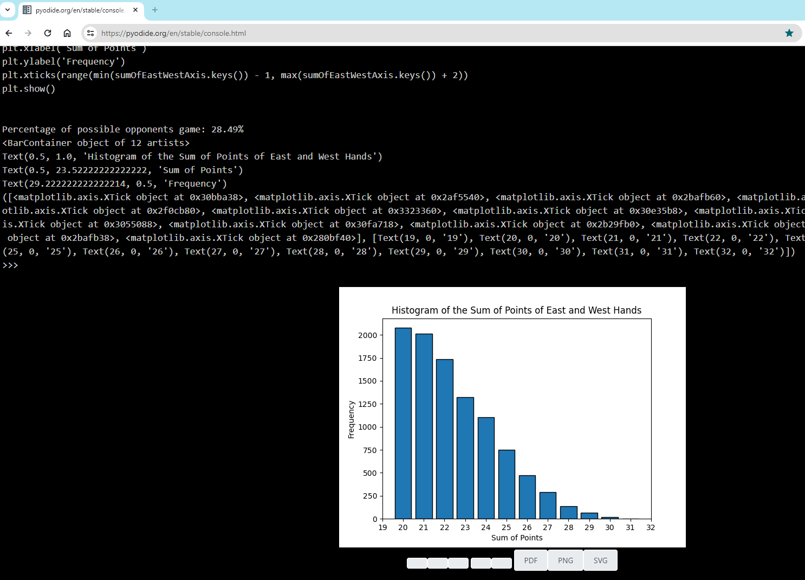

# ChatGPT prompt samples (OpenAI + GitHub Copilot)

## 1. Bridge: Simulation of Dealing 3 Hands

&emsp;Another day I was arguing with my friends about how to bid for a given hand in bridge. 
&emsp;I'm in 3rd position and the bidding was: _Pas, Pas_ 
&emsp;My hand: 

    
    
    
    
    
    
    
    
    
    
    
    
    

<!-- from https://commons.wikimedia.org/w/index.php?search=Byron+Knoll+Playing+cards&title=Special:MediaSearch&go=Go&type=image&sort=recency -->

&emsp;If I had had less than 6-7 points, I would have clearly bid 3 spades, but with 9 points and a nice distribution, I thought that maybe I would go down 3 but could make 2. 😁
Or maybe they don't have a game, and I can push myself up to 3 spades in the bidding or even 4s if they discover they have a game in hearts. 
&emsp;They argued that after the two "Pass", the chance that the opponents have >=24 points is high, so it is not good to give them time to discover their suits; therefore, I should bid right away: 3 spades. 
&emsp;But my gut didn't really tell me that they were more likely to have game points…😄

&emsp;Where does this simulation come from.😉

_**NOTE:** Actually, it was more of an excuse to see how I get along with the ChatGPT prompt and GitHub Copilot in VS Code. You can view the initial prompt [here](<Bridge/Bridge.ChatGPT 4o.txt>) and the subsequent ones in the commits history of bridge.py file._

And the results: (via Pyodide terminal emulator / Python 3.11.3 (main, Mar 31 2024 11:27:51) on WebAssembly/Emscripten 👍)

And just for fun 
[a discussion with ChatGPT about this hand](Bridge/ChatGPT%20discussion%20about%20this%20bridge%20hand.pdf) 😄

## 2.1. NN-XOR Solved by 2 Crossing Layers (2 x 1 Perceptron)   &emsp; &nbsp; (1st Layer trained first)

&emsp;The same old story of the XOR problem ([A kind of 'study' of the XOR problem in neural networks 😄](https://github.com/Dani-Luk/NN-XOR)), now solved by a 2-layer model with each layer having 1 perceptron. 
&emsp;The first layer will learn the bitwise AND operation (or something else, at your discretion) and try to best separate its classes. 
&emsp;The second layer, by incorporating the output of the first (frozen) layer as a third input dimension(z-elevation), will attempt to achieve the XOR results.

&emsp;You can start training the second layer at any point in the learning process of the first layer simply by moving the cursor of the first slider and clicking the "Train layer 2" button. 

The second plot shows:
- the 4 input data points (00, 01, 10, 11) corroborated with z-elevation given by the first model's result
- ${\color{#f7fc00}■}$ the decision boundary plane
- ${\color{#96e8e8}■}$ the z=0 plane 
- ${\color{#81bf3d}■}$ the line of intersection of this two planes 

The circles (points) on the plots are colored in such a way that: 
- there are 2 colors for the border, representing the 2 classes

- there are 2 colors (the same ${\color{red}●}$ ${\color{blue}●}$ for an easier visualization) for the inside, representing the side position relative to the decision boundary (line or plane). 

The model is considered 'good' if the points on one side have the same color pattern.

#### A snapshot:
<!--  -->
[![png snapshot][IMG_PNG]][IMG_PNG]

#### An animated Gif (thx [Ezgif](https://ezgif.com/)):
[![Gif animated][ANIM_GIF]][ANIM_GIF]

#### YouTube video: [https://youtu.be/St4yNx8MQJA](https://youtu.be/St4yNx8MQJA)

### Afterthought:
&emsp; And what if I don't train the first layer at all?! Will it be able to find an 'operation' by itself? 😁 

[IMG_PNG]: <NN-XOR cross 2 layers/NN-XOR cross 2 layers.png>
[ANIM_GIF]: <NN-XOR cross 2 layers/NN-XOR cross 2 layers 10 sec 895 px.gif>

## 2.2. NN-XOR Solved by 2 Crossing Layers (2 x 1 Perceptron)   &emsp; &nbsp; (1st Layer in Self-Discovery mode)

&emsp;Added a checkbox to disable training for the first layer.  
&emsp;The results of the goals are still editable, but only for better visualization of the color of the points divided by the decision boundary (if you configure the correct operation, of course 😄).

And some results:

| [![0∘1=1][IMG_01]][IMG_01] | [![1∘1=1][IMG_11]][IMG_11] |
|---------------------------------|---------------------------------|
| [![0∘0=0][IMG_00]][IMG_00] | [![1∘0=1][IMG_10]][IMG_10] |

Playing, I have a strong feeling that he succeeds from any starting position!
Though I added some 0.5 bias to place the starting point in the "middle" (I thought to balance the chances of going to any of the 4 corners). 

#### YouTube video: [https://youtu.be/-3slC32osPk](https://youtu.be/-3slC32osPk)

[IMG_01]: <NN-XOR cross 2 layers 1st self discovering/01.png>
[IMG_11]: <NN-XOR cross 2 layers 1st self discovering/11.png>
[IMG_00]: <NN-XOR cross 2 layers 1st self discovering/00.png>
[IMG_10]: <NN-XOR cross 2 layers 1st self discovering/10.png>

### Afterthought:
&emsp; And what if I give some help to my little friend? 😀  
&emsp; Well, I have to ask the big G.:  
/I wonder if.png>)

## 2.3. NN-XOR Solved by 1 Perceptron ...   &emsp; &nbsp; (with 3 inputs = 2 + 1 custom feature) 

&emsp;Let's face it, matplotlib's UI widgets aren't... "Wow" 😁. Here, I try Tkinter instead (not quite Qt yet, but anyway 😉).

/custom_feature_SlightlyBent.png>)

Legend:
- **AND** is <i>and</i> 😉
- ... 
- **SlightlyBent**: the 4 points almost form a plane, just to see if it can find a way to separate them
- **RND**: 4 random points in the range [-1.00, 1.00) generated from the seed: __*Rng Seed*__ (click *__Rnd__* to shuffle)

#### YouTube video: [https://youtu.be/HI6J4g0EkKo](https://youtu.be/HI6J4g0EkKo)

That's it! 🥳

Just a quick question: is there a difference in convergence achievement between the "valid" operations? (excluding **XOR**, ofc 😜)  
And one final thought: is this solution better than the others? 🤔  
(I encourage you to reflect on it.)

That's all, folks! 
I hope you enjoyed this little journey. 😉 
Bye! 
/Thats All Folks.gif>)

